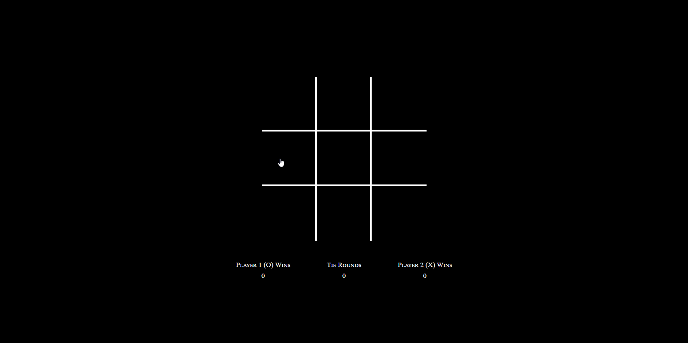

# TicTacToeOOP
> Simple tic-tac-toe game which I made during pair coding.

Should be available at [GitHub Pages](https://dmitrykulakovfrontend.github.io/TicTacToeOOP)

This project was made during pair coding with Abdul Shabbir ([@abdulshabbirdev](https://twitter.com/abdulshabbirdev)). Was a big pleasure to code with him and figuring out how to complete it!

## Meta

Dmitry Kulakov – [@AtomEistee](https://twitter.com/AtomEistee) – atomeistee@gmail.com

Abdul Shabbir - [@abdulshabbirdev](https://twitter.com/abdulshabbirdev) - abdulqshabbir@gmail.com
